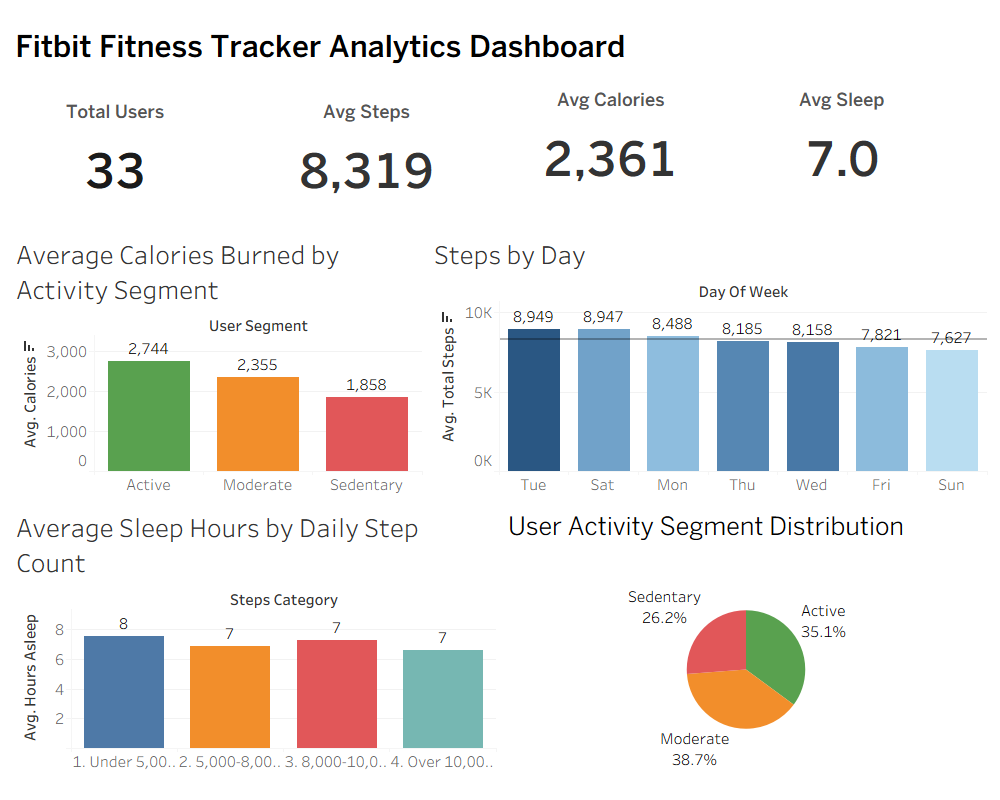
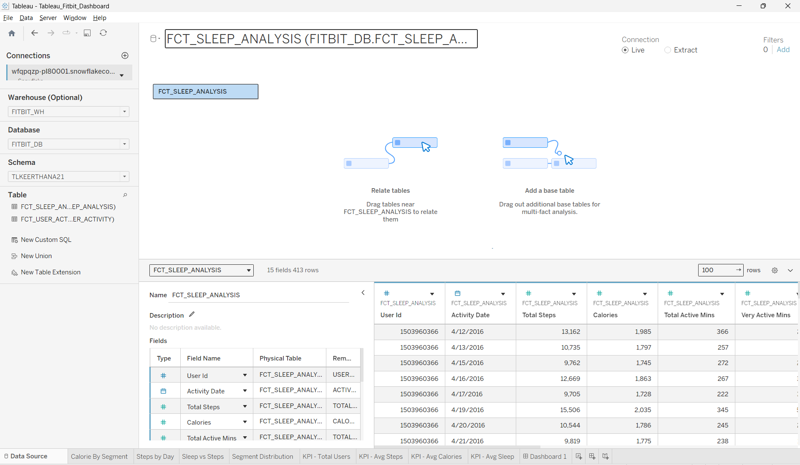

# Fitbit Fitness Tracker Analytics Pipeline

An end-to-end data analytics project analyzing Fitbit fitness tracker data for 33 users over 30 days (April 12 – May 12, 2016), built as the capstone for the **Google Data Analytics Professional Certificate**.

This project demonstrates a complete modern data stack pipeline used by companies like Airbnb, Spotify, and DoorDash.

## Pipeline Architecture

```
Raw CSV Files → MySQL → Snowflake → dbt Cloud → GitHub CI/CD → R + ggplot2 → Tableau
```

| Phase | Tool | Purpose | Status |
|-------|------|---------|--------|
| 1 | MySQL | Manual data cleaning and exploration | ✅ Complete |
| 2 | Snowflake | Cloud data warehouse | ✅ Complete |
| 3 | dbt Cloud | Data transformation pipeline (staging + analytics models) | ✅ Complete |
| 4 | R + ggplot2 | Statistical analysis and visualization | ✅ Complete |
| 5 | Tableau | Interactive dashboard with KPIs | ✅ Complete |

## Dashboard



> Built in Tableau Desktop connected to Snowflake. Includes 4 KPI cards, 3 bar charts, and 1 pie chart analyzing activity segments, daily steps, calorie burn, and sleep patterns.
>
> **To interact with the dashboard:** Download the `.twbx` file from the `tableau/` folder and open it with [Tableau Reader](https://www.tableau.com/products/reader) (free).

## Snowflake Cloud Data Warehouse



> Live connection from Tableau Desktop to Snowflake warehouse `FITBIT_WH`, database `FITBIT_DB`, schema `TLKEERTHANA21`, pulling from `FCT_USER_ACTIVITY` and `FCT_SLEEP_ANALYSIS` analytics tables built by dbt Cloud.

## Key Findings

### Q1: How do activity levels affect calorie burn?
Active users burn **886 more calories per day** than Sedentary users (2,744 vs 1,858 calories). This confirms that higher physical activity directly correlates with increased calorie expenditure.

### Q2: Which days are users most active?
**Tuesday (8,949 steps)** and **Saturday (8,947 steps)** are the most active days. Sunday is the least active at 7,627 steps, suggesting users are most motivated at the start of the work week and on weekends.

### Q3: Does more activity lead to better sleep?
**Counterintuitively, no.** Users with under 5,000 daily steps sleep an average of **7.57 hours**, while users with over 10,000 steps sleep only **6.61 hours**. More active users may have busier lifestyles that reduce sleep time.

### User Segment Distribution
- **Moderate (38.7%)** — 13 users averaging 5,000–9,999 steps/day
- **Active (35.1%)** — 12 users averaging 10,000+ steps/day
- **Sedentary (26.2%)** — 9 users averaging under 5,000 steps/day

## Dataset

Source: [Fitbit Fitness Tracker Data](https://www.kaggle.com/datasets/arashnic/fitbit) (Kaggle, CC0 Public Domain)

| File | Snowflake Table | Rows | Key Columns |
|------|----------------|------|-------------|
| dailyActivity_merged.csv | RAW.RAW_DAILY_ACTIVITY | 940 | Steps, Calories, Active Minutes |
| sleepDay_merged.csv | RAW.RAW_SLEEP_DAY | 413 | Minutes Asleep, Time in Bed |
| weightLogInfo_merged.csv | RAW.RAW_WEIGHT_LOG | 67 | Weight, BMI |

## Snowflake Database Structure

| Schema | Tables/Views | Created By |
|--------|-------------|------------|
| RAW | RAW_DAILY_ACTIVITY, RAW_SLEEP_DAY, RAW_WEIGHT_LOG | Manual CSV upload |
| STAGING | STG_DAILY_ACTIVITY, STG_SLEEP_DAY, STG_WEIGHT_LOG (views) | dbt Cloud |
| TLKEERTHANA21 | FCT_USER_ACTIVITY, FCT_SLEEP_ANALYSIS (tables) | dbt Cloud |

## dbt Cloud Models

### Staging Models (FITBIT_DB.STAGING)

| Model | Transformations |
|-------|----------------|
| stg_daily_activity | Fix date format, remove 0-step rows, add UserSegment, DayOfWeek, TotalActiveMinutes |
| stg_sleep_day | Strip timestamp, convert minutes to hours, add sleep quality label, wasted bed minutes |
| stg_weight_log | Round values, add BMI category label |

### Analytics Models (FITBIT_DB.TLKEERTHANA21)

| Model | Business Questions Answered |
|-------|---------------------------|
| fct_user_activity | Steps vs Calories correlation, most active days of the week |
| fct_sleep_analysis | Sleep duration vs daily step count relationship |

## R Analysis

Four R scripts in the `R/` folder perform the statistical analysis:

| Script | Purpose |
|--------|---------|
| 01_connection.R | Snowflake connection via ODBC |
| 02_data_load.R | Load FCT_USER_ACTIVITY and FCT_SLEEP_ANALYSIS |
| 03_analysis.R | dplyr analysis answering 3 business questions |
| 04_visualizations.R | 4 ggplot2 charts saved as 300 DPI PNGs |

## Tableau Dashboard Components

| Component | Chart Type | Data Source |
|-----------|-----------|-------------|
| KPI Cards | Text (Total Users, Avg Steps, Avg Calories, Avg Sleep) | FCT_USER_ACTIVITY / FCT_SLEEP_ANALYSIS |
| Calories by Segment | Bar chart — Avg calories by Active/Moderate/Sedentary | FCT_USER_ACTIVITY |
| Steps by Day | Bar chart — Avg steps by day of week | FCT_USER_ACTIVITY |
| Sleep vs Steps | Bar chart — Avg sleep hours by step category | FCT_SLEEP_ANALYSIS |
| Segment Distribution | Pie chart — User count by segment (COUNTD) | FCT_USER_ACTIVITY |

## Repository Structure

```
fitbit-analytics-pipeline/
├── models/
│   ├── staging/
│   │   ├── sources.yml
│   │   ├── stg_daily_activity.sql
│   │   ├── stg_sleep_day.sql
│   │   └── stg_weight_log.sql
│   └── analytics/
│       ├── fct_user_activity.sql
│       ├── fct_sleep_analysis.sql
│       └── analytics_models.yml
├── R/
│   ├── 01_connection.R
│   ├── 02_data_load.R
│   ├── 03_analysis.R
│   ├── 04_visualizations.R
│   └── visualizations/
│       ├── calories_by_segment.png
│       ├── steps_by_day.png
│       ├── sleep_vs_steps.png
│       └── segment_distribution.png
├── tableau/
│   ├── Tableau_Fitbit_Dashboard.twbx
│   ├── Dashboard.png
│   └── snowflake_connection.png
├── dbt_project.yml
└── README.md
```

## Tools & Technologies

- **SQL** — MySQL, Snowflake (CTEs, window functions, aggregations)
- **Snowflake** — Cloud data warehouse (FITBIT_WH, FITBIT_DB)
- **dbt Cloud** — Data transformation pipeline with staging and analytics layers
- **GitHub** — Version control with CI/CD integration for dbt
- **R** — Statistical analysis with dplyr, ggplot2, and ODBC connection to Snowflake
- **Tableau Desktop** — Interactive dashboard with KPI cards, bar charts, and pie chart connected live to Snowflake

## How to View the Dashboard

1. Download `tableau/Tableau_Fitbit_Dashboard.twbx`
2. Install [Tableau Reader](https://www.tableau.com/products/reader) (free) if you don't have Tableau Desktop
3. Open the `.twbx` file — all data is packaged inside, no Snowflake connection required

## Google Data Analytics Certificate

This project follows the six phases of the Google Data Analytics framework: **Ask → Prepare → Process → Analyze → Share → Act**, applied to real-world fitness tracker data to derive actionable wellness insights.

## Author

**Lakshmi Keerthana Tatikonda**
- M.S. in Computer Science, Virginia Commonwealth University (May 2026)
- [LinkedIn](https://www.linkedin.com/in/keerthana-tatikonda)
- [GitHub](https://github.com/keerthana-tatikonda)
